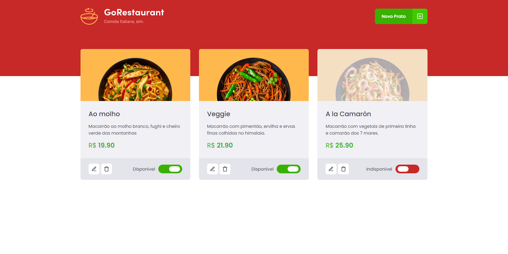

<h1 align="center">
    
</h1>

    

## :dart: Desafio do Ignite

Neste desafio temos um projeto que já esta pronto e o principal objetivo é realizar a migração de Javascript para Typescript e de Class Components para Functions Components, seguindo as instruções deixadas no desafio.

## :thinking: Como rodar o projeto?

1. `yarn` para instalar as dependências

2. `yarn server` para rodar a fake API feita com [JSON Server](https://github.com/typicode/json-server)

3. `yarn start` para executar a aplicação
